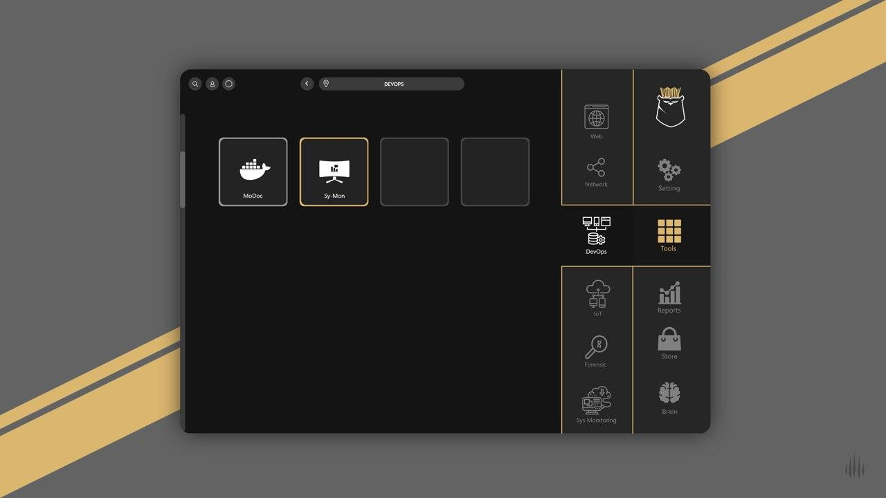

    

# Kodiak Desktop

# ABOUT.

Program introduction
The Kodiak app is being developed by the Hacktor team. Programming has begun in Agu 2018 and is currently preparing and developing for the big deal.
The program aims to monitor all systems, network devices, devices that access the Internet and even test their intrusion. It also manages and monitors all web services, such as the docker, which you can monitor and control to suit your needs.
By installing the Kodiak engine you can access the web application as well as its mobile applications for free and easily control your computer systems and services around the world.
Even network engineers and network security engineers can test the security of their systems with a few clicks to install security AddOn.
This app is written in a plugin base architecture then you can Install and use it on your Kodiak. Thay will automatically be added to all your user platforms. 
To download your plugins, you can download it from GitHub or download and install it in the Store section of this application.
Note: You are using Kodiak for the first time. It does not have any plugins and you need to install some of them.

# Plan layout
The purpose of the KodiakX program was to allow system users to easily monitor and control all of their systems and even test them for vulnerabilities and fix them as soon as possible. As mentioned, this system is written in Cross Platform and all users with any operating system can use it.
The system architecture is designed so that you can write Python for your desktop and sell it for free or in the Kodiak store. All the technology used in the system is told on hacktor.co's website what language you can write for each platform.
The code and program architecture are described separately in a separate document. We will prepare it very soon.

# The purpose of the program

The purpose of this system is to have easy access to your systems and have the right toolbox that you can use anywhere.
KodiakX easy access to information systems.

  

# SUPPORTED DISTRIBUTIONS
|Distribution | Version Check | released | builded |status |
----------|-------|------|------|-------|
|Linux|1.0.0.1-alpha|Yes|Yes|working|
|OSx|1.0.0.1-alpha|Yes|Yes|working|
|Windows|1.0.0.1-alpha|Yes|Yes|working|

### Linux platforms
How to install Kodiak on linux platforms
        Download it from hacktor.co web site or from here then double click on Kodiak then use it.

### OSx platforms
How to install Kodiak on Mac Os
        Dowload it from hacktor.co web site or from here then got to directory with terminal and execute this command line => ./kodiak

### Windows platforms
How to run Kodiak on Windows
        Download it from hacktor.co web site or from here then double click on Kodiak.exe then use it.
